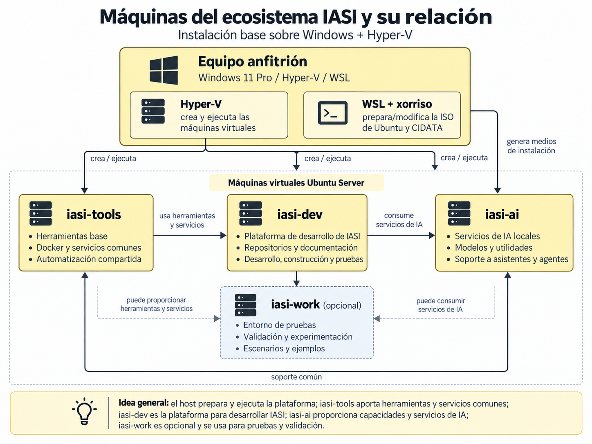

# Instalación

La configuración anterior es general. Este capítulo describe una **instalación concreta de referencia** que materializa ese modelo.

La variante utilizada actualmente combina:

- **Host**: Windows;
- **gestión de máquinas virtuales dentro de Windows**: Hyper-V;
- **sistemas invitados**: Ubuntu Server y Kubuntu.

La relación entre estas piezas es deliberadamente jerárquica: Windows es la plataforma del host, Hyper-V es una capacidad de esa plataforma y las máquinas virtuales son los entornos aislados donde viven los nodos IASI.

```{.plantuml}
@startuml
left to right direction

skinparam shadowing false
skinparam rectangle {
  BackgroundColor #FFF7D6
  BorderColor #666666
}

rectangle "Host" as host {
  rectangle "Windows" as windows {
    rectangle "Hyper-V" as hyperv
  }
}

rectangle "Guests" as guests {
  rectangle "Ubuntu Server" as ubuntu
  rectangle "Kubuntu" as kubuntu
}

hyperv --> guests : crea y ejecuta
@enduml
```

Esta combinación es la **plataforma soportada de referencia** para el procedimiento descrito en esta guía. No constituye un requisito arquitectónico de IASI.

Otra plataforma puede implementar el mismo modelo siempre que proporcione capacidades equivalentes y disponga de los mecanismos de instalación correspondientes.

## Principio de aislamiento

De acuerdo con los principios de diseño de IASI, el **equipo anfitrión no se convierte en una máquina IASI**.

El host proporciona las capacidades necesarias para crear y ejecutar el entorno, pero los runtimes, toolchains, servicios y dependencias propias de IASI se instalan en los sistemas invitados correspondientes.

Esto permite reconstruir, actualizar o eliminar el entorno sin ir acumulando dependencias específicas de IASI sobre la máquina anfitriona.

{fig-alt="Infraestructura IASI sobre Windows y Hyper-V" fig-cap="Instalación de referencia del ecosistema IASI."}

La figura muestra una materialización concreta del principio: el anfitrión prepara y ejecuta la plataforma, mientras que las funciones del ecosistema quedan aisladas en las máquinas virtuales destinadas a ellas.
